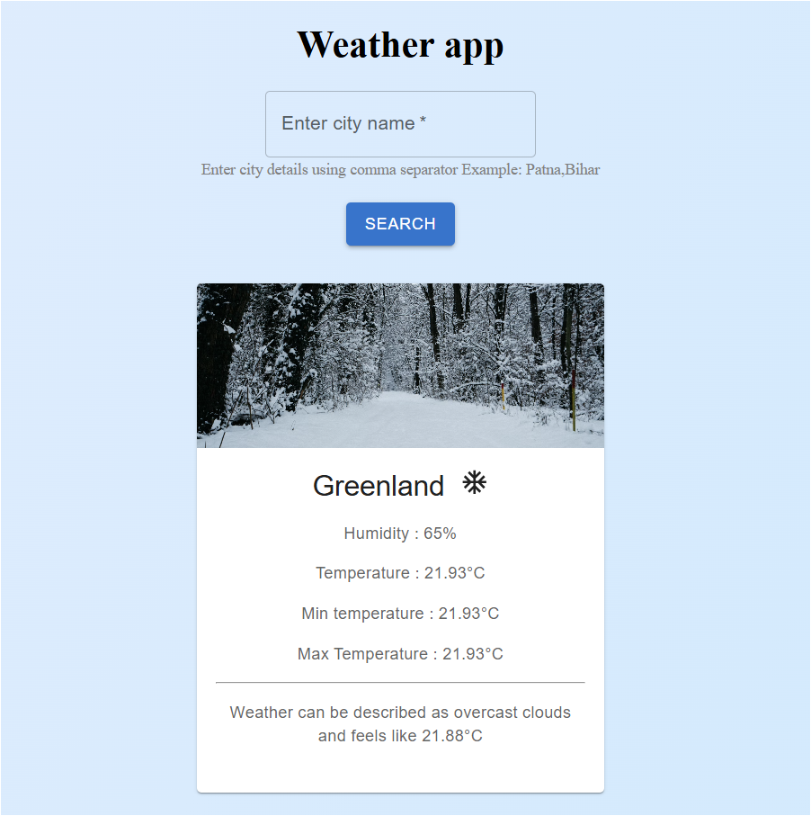

# Weather App 🌤️

A modern, responsive weather application built with React and Material-UI that provides real-time weather information for any city worldwide.



## Features ✨

- 🔍 Search for weather by city name
- 📍 Support for city,state format (e.g., "Patna,Bihar")
- 🌡️ Display of current temperature
- 🌤️ Weather description
- 💧 Humidity information
- 🌡️ Min/Max temperature
- 🎯 "Feels like" temperature
- 🖼️ Dynamic weather icons
- 📱 Fully responsive design
- 🎨 Modern Material-UI interface

## Tech Stack 🛠️

- React.js
- Material-UI
- OpenWeather API
- Vite
- CSS3

## Getting Started 🚀

### Prerequisites

- Node.js (v14 or higher)
- npm or yarn

### Installation

1. Clone the repository : [CLONE REPO](https://github.com/bharatalok11/React-Apna-College.git)


2. Install dependencies:
```bash
npm install
```

3. Create a `.env` file in the root directory and add the following environment variables:

## Environment Variables 📝

The application uses the following environment variables:

| Variable | Description | Example |
|----------|-------------|---------|
| `VITE_API_URL` | Base URL for OpenWeather API | `https://api.openweathermap.org/data/2.5/weather` |
| `VITE_API_KEY` | Your OpenWeather API key | `your_api_key_here` |
| `VITE_HOT_URL` | Background image for hot weather | Unsplash image URL |
| `VITE_RAIN_URL` | Background image for rainy weather | Unsplash image URL |
| `VITE_SNOW_URL` | Background image for snowy weather | Unsplash image URL |

**Note:** 
- All environment variables must be prefixed with `VITE_` to be accessible in the React application
- Never commit your `.env` file to version control
- Keep your API key secure and don't share it publicly
- The background images are from Unsplash and are used based on weather conditions

<hr>

4. Start the development server:
```bash
npm run dev
```


## Usage 📝

1. Enter a city name in the search box
2. For more accurate results, use the format: "City,State" or "City,Country"
3. Click the Search button or press Enter
4. View the weather information displayed in the card below

## Project Structure 📁

```
weather-app/
├── src/
│   ├── assets/
│   │   ├── weather.png
│   │   └── react.svg
│   ├── components/
│   │   ├── SearchBox.jsx
│   │   ├── SearchBox.css
│   │   ├── InfoBox.jsx
│   │   └── InfoBox.css
│   ├── App.jsx
│   └── main.jsx
├── .env
└── README.md
```

## API Integration 🔌

This project uses the OpenWeather API to fetch weather data. The API provides:
- Current weather conditions
- Temperature in Celsius
- Humidity percentage
- Weather description
- Weather icons


<hr/>
<div align="center">

Created by [bharatalok11](https://github.com/bharatalok11)

**Happy Coding! ❤️**

</div>
