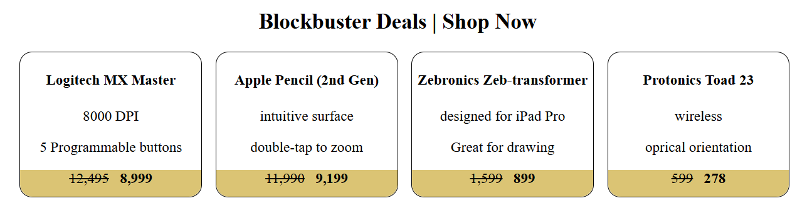

## Product Card Showcase
1. Demonstrates basic product card functionality.
2. Includes components for displaying products, prices, and product tabs.



### Folder Structure

The main components are:
- `App.jsx` - Main application component
- `Product.jsx` - Product display component
- `Price.jsx` - Price display component
- `ProductTab.jsx` - Product tab navigation component
- `Activity1.jsx` - Activity component

### Getting Started

1. Clone the repository : [CLONE REPO](https://github.com/bharatalok11/React-Apna-College.git)

```bash
cd part1_part2
```

2. Install dependencies:
```bash
npm install
```
3. Start the development server:
```bash
npm run dev     
```


### Tech Stack

- React 19.1.0
- Vite 6.3.5


<hr/>
<div align="center">

Created by [bharatalok11](https://github.com/bharatalok11)

**Happy Coding! ❤️**
</div>