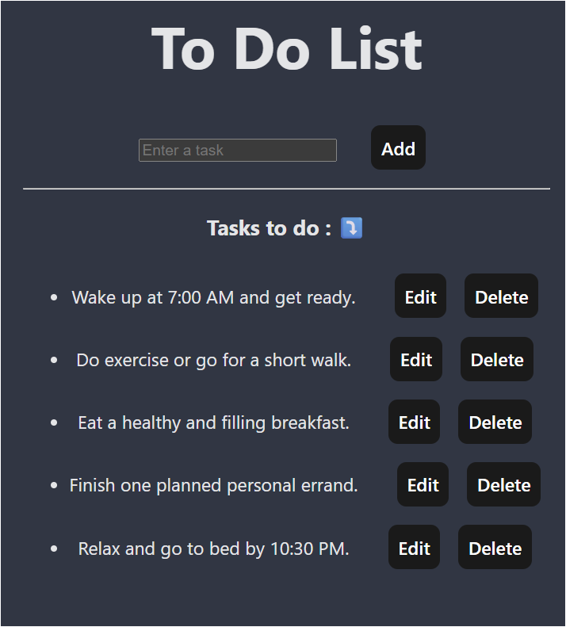
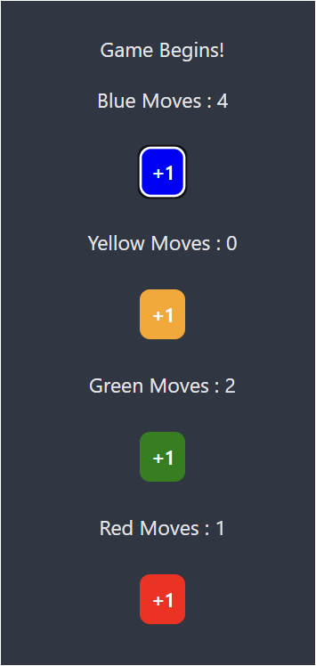

# React Todo List and Ludo Board

1. Demonstrates advanced React concepts with a Todo List application and Ludo Board game implementation.

## Folder Structure

The main components are:
- `App.jsx` - Main application component
- `ToDoList.jsx` - Modern React Todo List implementation
- `ToDoListJavascriptWay.jsx` - Alternative Todo List implementation using JavaScript approach
- `LudoBoard.jsx` - Interactive Ludo game board component

### Component Previews

#### Todo List Component


#### Ludo Board Component


## Features

- Modern Todo List with React state management
- Alternative Todo List implementation for comparison
- Interactive Ludo Board game
- Component-based architecture
- State management and event handling

## Getting Started

1. Install dependencies:
```bash
npm install
```

2. Start the development server:
```bash
npm run dev
```


## Tech Stack

- React 19.1.0
- Vite 6.3.5
- Modern JavaScript features


## ESLint Configuration

The project includes ESLint configuration for maintaining code quality. For production applications, consider:
- Using TypeScript with type-aware lint rules
- Following the [TS template](https://github.com/vitejs/vite/tree/main/packages/create-vite/template-react-ts) for TypeScript integration
- Implementing [`typescript-eslint`](https://typescript-eslint.io) for enhanced type checking

<hr/>
<div align="center">

Created by [bharatalok11](https://github.com/bharatalok11)

**Happy Coding! ❤️**

</div>
