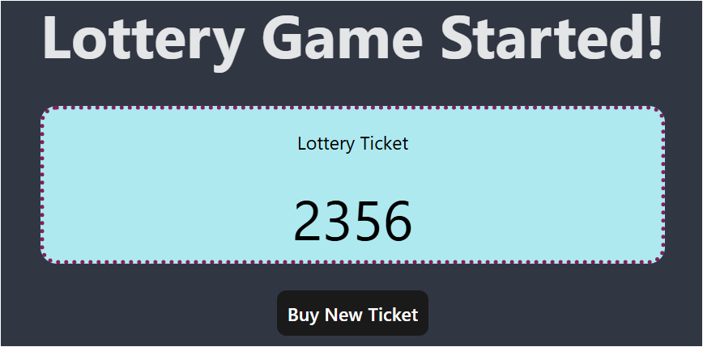
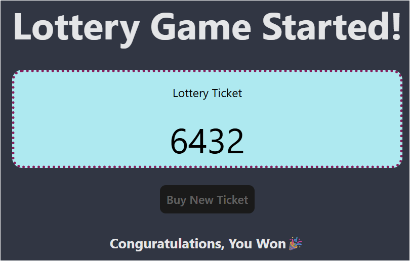

# Lottery Ticket Generator

1. A React-based lottery ticket generator  that creates random lottery numbers. 
2. Demonstrates the use of React components, state management, and modern web development practices.

## Features

- Generate random lottery numbers
- Clean and modern user interface
- Component-based architecture

## Images

### Screenshots


*Initial lottery ticket generation screen*


*Winning lottery ticket screen*


## Technologies Used

- React 19
- Vite
- CSS3
- ESLint for code quality

## Getting Started

### Prerequisites

- Node.js (Latest LTS version recommended)
- npm or yarn package manager

### Installation


1. Clone the repository : [CLONE REPO](https://github.com/bharatalok11/React-Apna-College.git)

```bash
cd part5
```

2. Install dependencies:
```bash
npm install
```

3. Start the development server:
```bash
npm run dev
```

4. Open the browser and navigate to `http://localhost:5173` to see the application.

### Available Scripts

- `npm run dev` - Start development server
- `npm run build` - Build for production
- `npm run preview` - Preview production build
- `npm run lint` - Run ESLint

## Project Structure

```
part5/
├── src/
│   ├── assets/         # Static assets and images
│   ├── App.jsx         # Main application component
│   ├── Lottery.jsx     # Lottery component
│   ├── Ticket.jsx      # Ticket component
│   ├── TicketNum.jsx   # Ticket number component
│   └── helper.js       # Utility functions
├── public/             # Public assets
└── package.json        # Project dependencies and scripts
```

<hr/>
<div align="center">

Created by [bharatalok11](https://github.com/bharatalok11)

**Happy Coding! ❤️**

</div>
